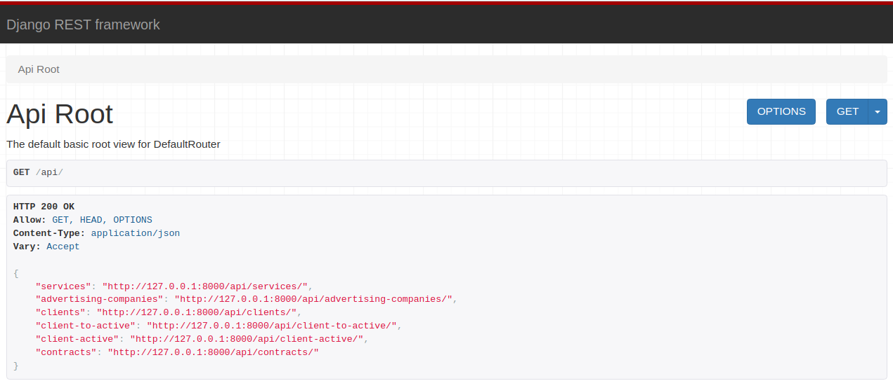

<style>
    body {
        background-color: rgba(231,234,236,0);
    }

    .logo {
        display: flex;
        justify-content: center;
    }
</style>

<div class="logo">

</div>
<h1 style="text-align: center">Проект CRM-системы.</h1>
<h2>Краткое описание:</h2>
Разработанная CRM-система позволит эффективно управлять 
процессом работы с клиентами, отслеживать результативность рекламных 
кампаний и повышать общую продуктивность бизнеса. 
Система включает в себя следующие функции:

1. CRM-система позволяет сотрудникам:

   * вести учёт предлагаемых компанией услуг;
   * запускать и завершать рекламные кампании;
   * учитывать потенциальных клиентов, которые заинтересовались
     конкретной рекламной кампанией;
   * переводить клиентов из статуса «потенциальные» в статус «активные»
     при составлении контрактов на сотрудничество.

2. В CRM-системе предустановлено несколько категорий пользователей с определёнными ролями:

   * администратор — создаёт пользователей и назначает им роли;
   * оператор — создаёт записи о потенциальных клиентах;
   * маркетолог — создаёт записи о предоставляемых услугах и о проводимых рекламных кампаниях;
   * менеджер — работает с потенциальными клиентами, создаёт контракты и переводит потенциальных клиентов в активные.

3. CRM-cистема также подсчитывает статистику успешности рекламных компаний,
   проводимых организацией. При этом системе необходимо учитывать несколько факторов:

   * количество потенциальных клиентов, заинтересовавшихся рекламой;
   * количество переходов клиентов из потенциальных в активные;
   * объёмы продаж по клиентам.

---

<h2>Инструкция по установке</h2>

Запуск через Docker-compose:
Открываем терминал, переходим в корневую папку с проектом:

1. Создаём образ командой ```docker-compose build```
2. Поднимаем контейнер ```docker-compose up```

---

<h2>Интерфейс веб-приложения</h2>

(логин под администратором)

* Statistics - страница со статистикой по рекламным компаниям.
* Services - страница со списком предоставляемых услуг.
* Advertisement - страница со списком рекламных компаний.
* Clients - страница со списком потенциальных клиентов.
* Active clients - страница со списком активных клиентов.
* Contracts - страница со списком контрактов.

---

<h2>API endpoints:</h2>


---

<h2>Архитектура проекта</h2>
Архитектура проекта на Django, который использует Gunicorn в 
качестве веб-сервера, WSGI для интеграции с веб-сервером и
PostgreSQL в качестве базы данных.

* Gunicorn : Веб-сервер, который обрабатывает входящие HTTP-запросы и передает их Django для обработки. Gunicorn работает поверх протокола WSGI (Web Server Gateway Interface), который определяет стандартный способ взаимодействия между веб-серверами и WSGI-совместимыми приложениями.

* PostgreSQL  : Система управления базами данных, которая хранит все данные приложения. Django легко интегрируется с PostgreSQL благодаря встроенной поддержке ORM (Object-Relational Mapper).

Это высокоуровневый взгляд на архитектуру проекта, который использует популярные инструменты и технологии для разработки веб-приложений.

---

<h2>Лицензия</h2>
Проект распространяется под лицензией MIT.